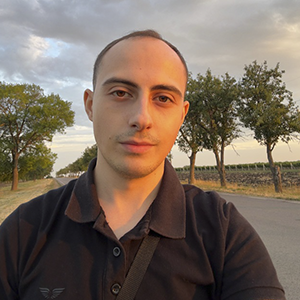

# Приветствие

👋 Привет, я Костя. Мне 21 год, студент Молдавского Государственного Университета на Факультете Математики и Информатики.

## Мое фото

## Кратко о себе

Сам по себе я застенчивый и добрый парень. Готов помочь в трудную минуту и поддержать 😄.
Я не особо люблю писать про себя такие слова, но т.к. я сам по себе являюсь таким человеком, то мне приходится 😅.

## Области интересов

Больше всего мне нравится 🏎️ авто-мотоспорт 🏍️.
Также тренируюсь игре на гитаре 🎸.
Нравится астрономия 🔭 и, в целом то, что связано с космосом 🪐.

## Знания языков программирования по-уровню

- 📈 **Выше среднего:** **_Java_.**
- ⚖️ **Средний уровень:** **_C++._**
- 🧱 **Базовый уровень:** **_JavaScript, PHP, Python._**
- 🛠️ Кроме того, есть понятия в работе с **HTML, CSS, JSON-форматом, Docker**.
- 🛠️ Опыт работы с базами данных: **Oracle Apex, msSQL, postgreSQL**.

